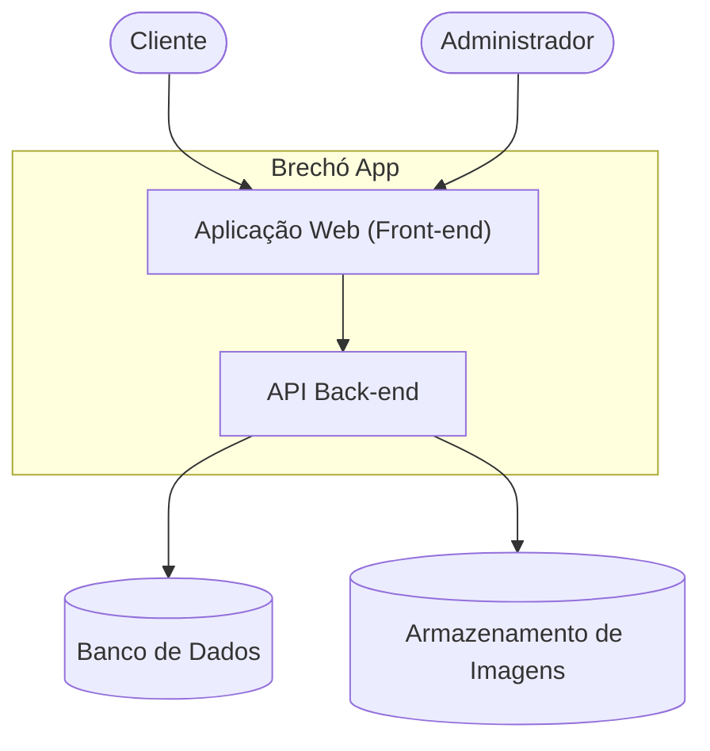
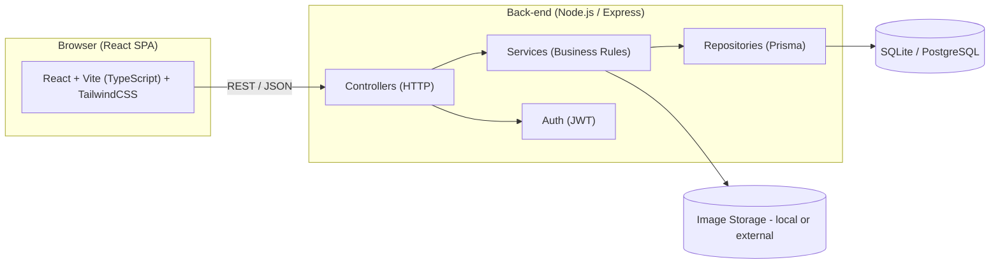

# Arquitetura do Projeto — Brechó App (TP2)

Este documento apresenta (i) as escolhas de tecnologias, (ii) o projeto arquitetural no modelo C4 (níveis 1 a 3) e (iii) as justificativas do modelo escolhido.

---

## 1. Escolhas de Tecnologias

### Front-end
- React + Vite (SPA simples, rápido para desenvolvimento)
- TypeScript (maior segurança de tipos)
- Tailwind CSS (produtividade no layout responsivo)
- Deploy: GitHub Pages ou Vercel

### Back-end
- Node.js + Express
- TypeScript
- Prisma (ORM)
- Banco inicial: SQLite (fácil para dev)
- Banco planejado: PostgreSQL (para produção)
- Autenticação: JWT
- Upload de imagens: pasta local (TP2), provedor externo (TP3+)

### Testes e Qualidade
- Jest (testes unitários)
- ESLint + Prettier (padrão de código)

---

## 2. C4 Model

### 2.1 C1 — Contexto


### 2.2 C2 — Contêineres


### 2.3 C3 — Componentes do Back-end
```mermaid
flowchart TB
    subgraph API["Express API"]
      subgraph Controllers
        C_Auth["AuthController"]
        C_Item["ItemController"]
      end

      subgraph Services
        S_Auth["AuthService"]
        S_Item["ItemService"]
      end

      subgraph Repositories
        R_User["UserRepository (Prisma)"]
        R_Item["ItemRepository (Prisma)"]
      end

      JWT["JWT Provider"]
      Uploader["Uploader (filesystem or external)"]
      Validator["Schema Validator"]
    end

    DB[(Database)]
    FS[(Uploads folder)]

    C_Auth --> S_Auth --> R_User --> DB
    C_Item --> Validator
    C_Item --> S_Item --> R_Item --> DB
    S_Item --> Uploader --> FS
    S_Auth --> JWT


